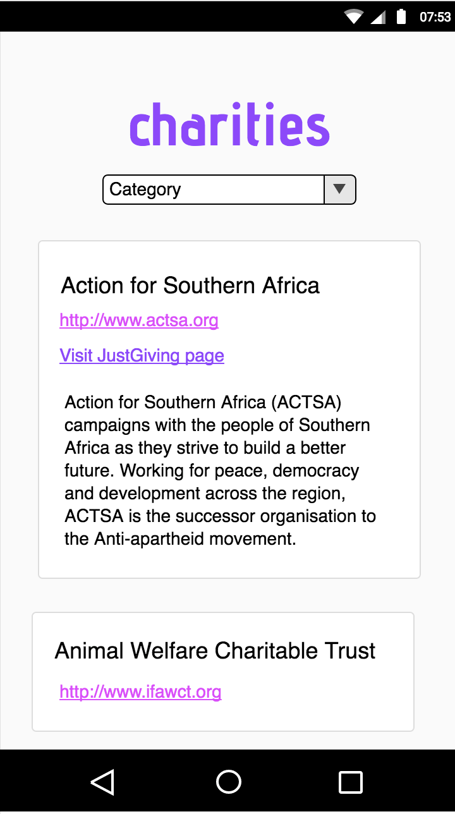

# JustGiving: View charities by category

https://just-giving.herokuapp.com

A web app using the JustGiving API to display charities registered on JustGiving.

## Installation

+ Create a `config.env` file in the root directory.

  Add the following:
  ```
  PORT=[choose port]
  JUST_GIVING_BASE_URL=api.sandbox.justgiving.com
  JUST_GIVING_API_KEY=[your api key]
```

+ Have Webpack installed globally: `npm i -g webpack`

+ Install dependencies: `npm i`

+ Build javascript file: `webpack`

+ Create cert.pem and key.pem files. Add them to lib/certs

+ Start the server: `npm start`

## Wireframes


